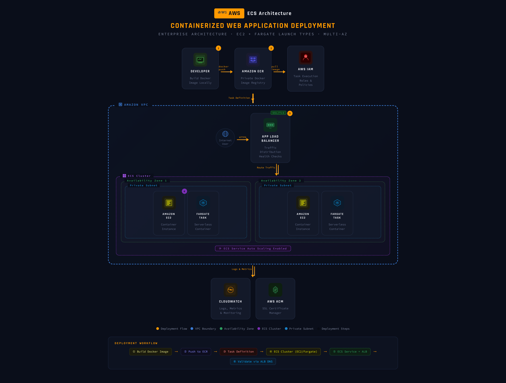
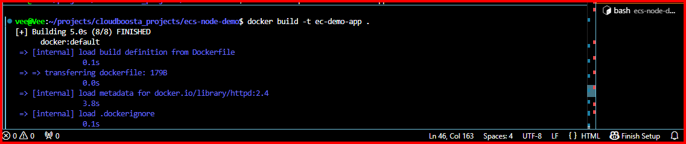
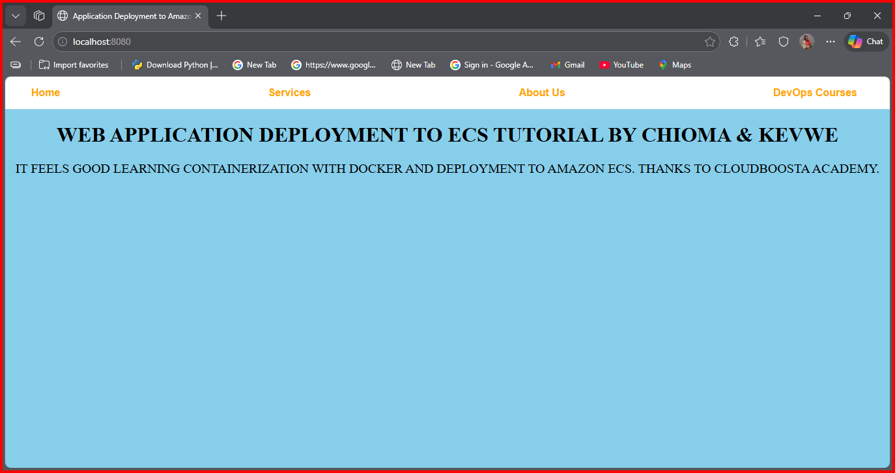
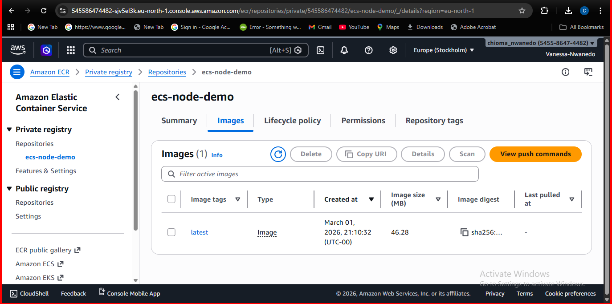
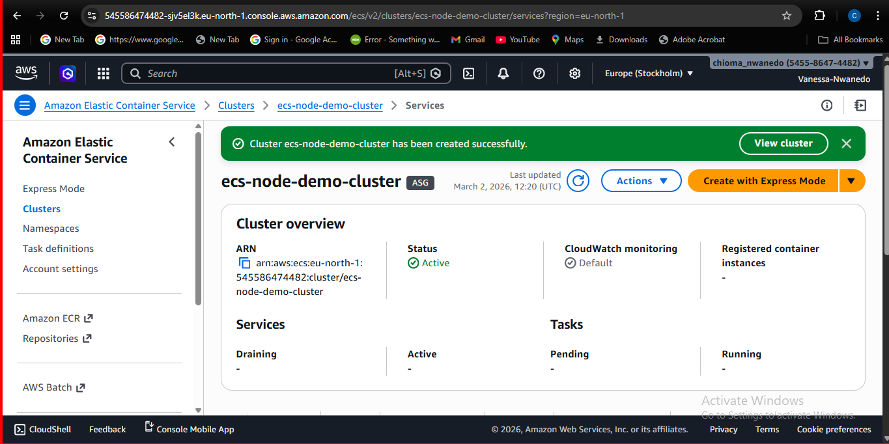
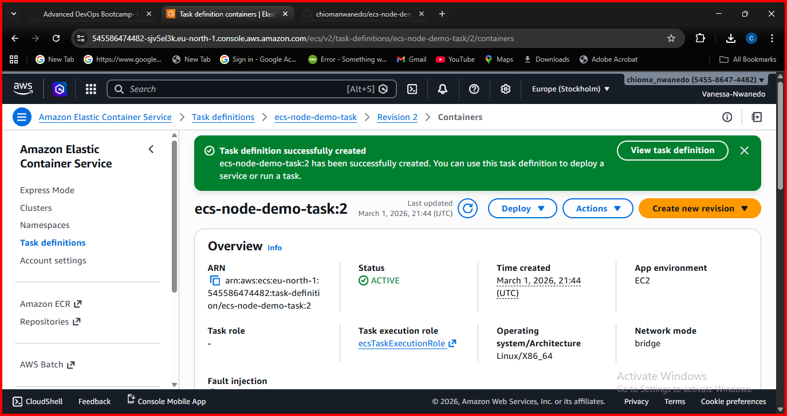
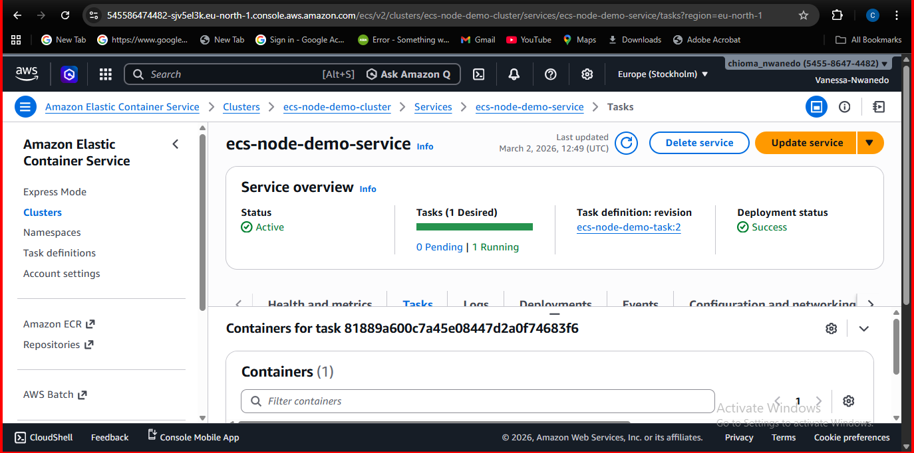
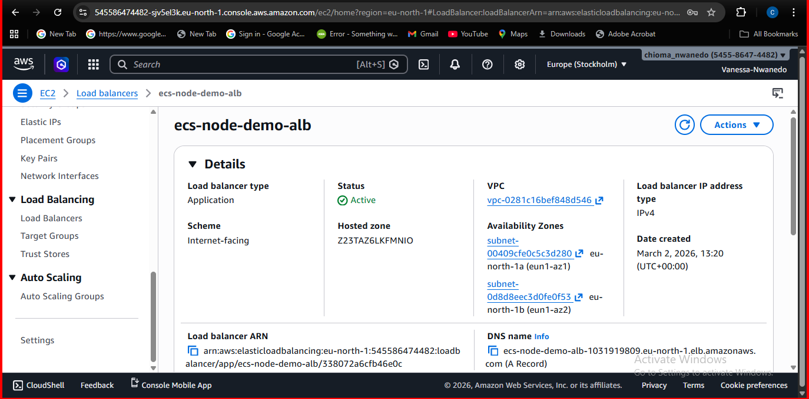
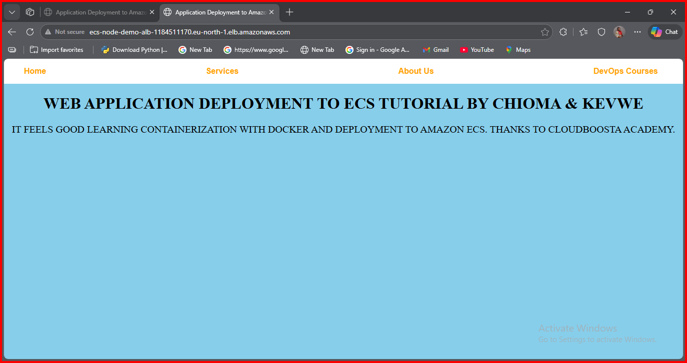

# ECS Application Deployment Project

**Author:** Chioma Vanessa Egwuibe &  Kevwe Collins Enaks

**Course:** Cloudboosta Training Peer Project

**Date:** 5th March 2026  

---

## Objective

The objective of this project is to containerize a web application using Docker, push the container image to Amazon Elastic Container Registry (ECR), deploy the container on Amazon Elastic Container Service (ECS) using the EC2 launch type, and expose the application to the internet using an Application Load Balancer (ALB).

The final result should be a working web application accessible through a public URL provided by the load balancer.

## Tools and AWS Services Used

The following tools and AWS services were used in this project:

### AWS Services
- **Amazon EC2** – Virtual servers used to host the ECS container instances.
- **Amazon Elastic Container Service (ECS)** – Container orchestration service used to deploy and manage the application.
- **Amazon Elastic Container Registry (ECR)** – Private Docker image registry used to store the container image.
- **Application Load Balancer (ALB)** – Distributes incoming traffic across the ECS tasks.
- **AWS Identity and Access Management (IAM)** – Provides secure access control and execution roles for ECS tasks.
- **Amazon CloudWatch** – Used for monitoring logs and metrics.

### Development and Deployment Tools
- **Docker** – Used to containerize the application into a portable image.
- **Visual Studio Code** – Code editor used for development and project documentation.
- **AWS CLI** – Command-line tool used to interact with AWS services.
- **Security Groups** – Virtual firewall rules used to control inbound and outbound traffic.

## Project Repository

The full source code and project files for this deployment are available in the following GitHub repository:

[GitHub Repository](https://github.com/chiomanwanedo/ecs-node-demo.git)


### Repository Structure

The repository contains the following project structure:

```
ecs-node-demo/
│
├── Dockerfile
├── index.html
├── package.json
├── package-lock.json
├── taskdef.json
│
├── README.md                
├── report.md                 
│
├── screenshots/              
│   ├── alb-configuration.png
│   ├── application-running-on-alb.png
│   ├── docker-image.png
│   ├── ecr-repository.png
│   ├── ecs-cluster.png
│   ├── ecs-service-running.png
│   ├── ecs-task-definition.png
│   ├── local-container-test.png
│   └── target-group-health.png
│
└── .gitignore
```

## Architecture Overview

The architecture of this project consists of a containerized web application deployed on ECS. User requests are routed through an Application Load Balancer which forwards traffic to the ECS service running on EC2 container instances.

The flow of traffic is as follows:

Internet → Application Load Balancer → Target Group → ECS Service → EC2 Container Instance → Docker Container → Web Application




## Step 1: Server Setup

The first step was preparing the environment required for the deployment.

The following tools were installed and configured:

- Docker for building and running containers
- AWS CLI for interacting with AWS services from the command line

AWS credentials were configured using the following command:

```bash
aws configure
```

This allowed the system to authenticate with AWS and access services such as ECR and ECS.


## Step 2: Containerizing the Application with Docker

A Dockerfile was created to define how the web application should be packaged into a container image.

The Dockerfile specifies:
- The base image
- The application dependencies
- The port the application listens on
- The command used to start the application

### Dockerfile

```dockerfile
FROM httpd:2.4

RUN echo "ServerName localhost" >> /usr/local/apache2/conf/httpd.conf

COPY index.html /usr/local/apache2/htdocs/

EXPOSE 80
```


### Step 3: Building the Docker Image

The Docker image was built locally using the following command:

```bash
docker build -t ecs-demo-app .
```


The container was tested locally to ensure the application works before pushing it to AWS.

```bash
docker run -p 8080:80 ecs-demo-app
```

This allowed the application to be accessed locally via:
http://localhost:8080




## Step 4: Pushing the Docker Image to Amazon ECR

After verifying that the application container works locally, the next step was to store the Docker image in **Amazon Elastic Container Registry (ECR)**. ECR is AWS’s managed container registry service used for storing and retrieving Docker images.

### Creating the ECR Repository

A new repository was created in the AWS Console under **Amazon ECR**. This repository stores the Docker image that will later be used by ECS to run the container.

### Authenticating Docker with ECR

Docker was authenticated with Amazon ECR using the AWS CLI:

```bash
aws ecr get-login-password --region eu-north-1 \
| docker login \
--username AWS \
--password-stdin 545586474482.dkr.ecr.eu-north-1.amazonaws.com
```

### Tagging the Docker Image

The locally built image was tagged with the ECR repository URI.

```bash
docker tag ecs-demo-app:latest \
545586474482.dkr.ecr.eu-north-1.amazonaws.com/ecs-node-demo:latest
```

### Pushing the Image to ECR

The Docker image was then pushed to the ECR repository.

```bash
docker push \
545586474482.dkr.ecr.eu-north-1.amazonaws.com/ecs-node-demo:latest
```

Once the push completed successfully, the image became available in the ECR repository and could be used by Amazon ECS to deploy containers.



## Step 5: Creating the ECS Cluster (EC2 Launch Type)

After pushing the Docker image to Amazon ECR, the next step was to create an **Amazon Elastic Container Service (ECS) cluster**. The ECS cluster provides the infrastructure where the containers will run.

For this project, the **EC2 launch type** was selected. This means that ECS tasks run on EC2 instances that are part of the cluster.

### Creating the Cluster

The cluster was created through the AWS Console by navigating to:

ECS → Clusters → Create Cluster

The same cluster can also be created using the AWS CLI:

```bash
aws ecs create-cluster --cluster-name ecs-node-demo-cluster
``` 

The following configuration was used:

- **Cluster type:** Fargate + Self managed EC2
- **Instance type:** t3.micro
- **Number of instances:** 1


When the cluster was created, AWS automatically launched an EC2 instance configured with the **ECS agent**. This agent allows the EC2 instance to communicate with the ECS service and run container tasks.

### ECS Container Instance Registration

After the EC2 instance started successfully, it automatically registered itself with the ECS cluster as a **container instance**. This instance provides the compute capacity required to run the containers defined in the task definition.

The ECS cluster was now ready to run containerized applications.

### ECS Cluster Overview

The screenshot below shows the ECS cluster with the registered EC2 container instance.



## Step 6: Creating the ECS Task Definition

After creating the ECS cluster, the next step was defining how the container should run. This is done using an **ECS Task Definition**.

A task definition acts as a blueprint for the container. It specifies important settings such as:

- The Docker image to use
- CPU and memory allocation
- Port mappings
- Container startup commands
- Logging configuration

### Task Definition Configuration

A new task definition was created in the AWS Console under:

ECS → Task Definitions → Create new task definition

The following configuration was used:

- **Launch type:** EC2
- **Container image:** Image stored in Amazon ECR
- **Container port:** 80
- **CPU allocation:** 256
- **Memory allocation:** 256 MB

The container image used in the task definition was:

```
545586474482.dkr.ecr.eu-north-1.amazonaws.com/ecs-node-demo:latest
```

This image was previously pushed to Amazon ECR.

### ECS Task Definition JSON

The following task definition configuration was used to run the container in the ECS cluster.

```json
{
  "family": "ecs-node-demo-task",
  "networkMode": "awsvpc",
  "requiresCompatibilities": ["EC2"],
  "cpu": "256",
  "memory": "256",
  "executionRoleArn": "arn:aws:iam::545586474482:role/ecsTaskExecutionRole",
  "containerDefinitions": [
    {
      "name": "ecs-node-demo",
      "image": "545586474482.dkr.ecr.eu-north-1.amazonaws.com/ecs-node-demo:latest",
      "essential": true,
      "portMappings": [
        {
          "containerPort": 80,
          "protocol": "tcp",
          "appProtocol": "http"
        }
      ]
    }
  ]
}
```

The container port was configured as port **80**, which allows the Application Load Balancer to route HTTP traffic to the running container. ECS automatically handles the networking configuration using the **awsvpc** network mode.

### ECS Task Definition

The screenshot below shows the ECS task definition configuration used for deploying the container.



## Step 7: Creating the ECS Service

After defining the task definition, the next step was creating an **ECS Service**. An ECS service ensures that a specified number of tasks remain running at all times.

If a task stops or fails, the ECS service automatically launches a replacement task. This provides high availability and ensures the application continues running.

### Service Configuration

The service was created within the ECS cluster using the previously created task definition.

The following configuration was used:

- **Cluster:** ecs-node-demo-cluster
- **Launch type:** EC2
- **Task definition:** ecs-node-demo-task
- **Desired number of tasks:** 1

The ECS service manages the lifecycle of the container and ensures that the application remains available.

### Integration with Load Balancer

During service creation, the service was configured to use an **Application Load Balancer (ALB)**.

The load balancer forwards incoming HTTP requests to the running ECS tasks. This allows the application to be accessed publicly through the load balancer's DNS name.


### ECS Service Running

The screenshot below shows the ECS service with a running task.



## Step 8: Configuring the Application Load Balancer

An **Application Load Balancer (ALB)** was created to expose the application to the internet.

The ALB distributes incoming traffic to the ECS tasks running on the EC2 container instances.

### Load Balancer Configuration

The following configuration was used:

- **Load balancer type:** Application Load Balancer
- **Scheme:** Internet-facing
- **Listener:** HTTP on port 80
- **Target group:** ECS container targets
- **Health check path:** /

The load balancer forwards incoming HTTP requests to the ECS service's target group, which routes traffic to the running container tasks.

Health checks were configured to ensure that traffic is only sent to healthy containers.


### Application Load Balancer

The screenshot below shows the Application Load Balancer configuration and the associated target group.




## Step 9: Testing and Validating the Deployment

After the ECS service and load balancer were configured successfully, the application was tested using the public DNS name of the Application Load Balancer.

The load balancer routes incoming HTTP requests to the ECS container running the application.

When accessing the ALB DNS name in a web browser, the application responded successfully, confirming that the deployment was successful.

```bash
curl -i http://<ALB-DNS>
```

### Application Running in Browser

The screenshot below shows the deployed application being accessed through the load balancer's public DNS name.




## Step 10: Security Considerations

Security is an important aspect of deploying applications in the cloud. In this project, several AWS security features were used to ensure that the deployment followed best practices.

### IAM Roles

IAM roles were used to allow ECS services to interact securely with other AWS services.

The following role was used in the task definition:

- **ecsTaskExecutionRole**

This role allows ECS to:
- Pull container images from Amazon ECR
- Send container logs to Amazon CloudWatch Logs

Using IAM roles avoids the need to store sensitive credentials directly inside the application container.

### Security Groups

Security groups were configured to control network traffic to the deployed resources.

The following rules were applied:

**Load Balancer Security Group**
- Allows inbound HTTP traffic on **port 80** from the internet.

**ECS Container Instance Security Group**
- Allows inbound traffic from the load balancer to the container port.
- Allows outbound traffic to access AWS services such as ECR.

These security group rules ensure that only the load balancer can communicate with the ECS containers, improving the overall security of the deployment.


## Challenges and Lessons Learned

During the deployment process, several challenges were encountered. Troubleshooting these issues helped improve understanding of how ECS and load balancing work.

### Troubleshooting Application Access

One challenge encountered was receiving an **"Empty reply from server"** when accessing the application through the load balancer. This issue was related to container port configuration and required verifying the container port settings in the ECS task definition and load balancer target group.

### Health Check Configuration

Ensuring that the load balancer health check path matched the application's available endpoints was important for the ECS service to mark the container as healthy.

### Understanding ECS Components

This project provided valuable experience with the following AWS services:

- Amazon ECS
- Amazon ECR
- Docker containerization
- Application Load Balancers
- IAM roles and security groups

Through this project, We gained practical experience deploying a containerized application in a cloud environment and understanding how different AWS services integrate to deliver scalable applications.

## Conclusion

This project demonstrated the end-to-end process of deploying a containerized web application on AWS using Amazon ECS with the EC2 launch type. The application was first containerized using Docker, then the image was pushed to Amazon Elastic Container Registry (ECR). An ECS cluster backed by EC2 instances was created to run the containerized workload.

A task definition was configured to specify the container image, CPU and memory resources, networking mode, and logging configuration. An ECS service was then created to manage the running tasks and ensure the application remained available.

Finally, an Application Load Balancer was configured to route incoming HTTP traffic to the ECS tasks, making the application accessible through a public URL. Testing confirmed that the deployment was successful and the application could be accessed through the load balancer.

Overall, this project provided practical experience with containerization, container orchestration, and cloud deployment using AWS services such as ECS, ECR, EC2, and Application Load Balancers.


The complete project files, including the Dockerfile, task definition, and documentation, are available in the GitHub repositories linked above.

## Appendix: Deployment Commands

For reproducibility and reference, the complete sequence of AWS CLI commands used during this deployment is documented separately.

See the full deployment log in:

docs/ecs-deployment-log.md